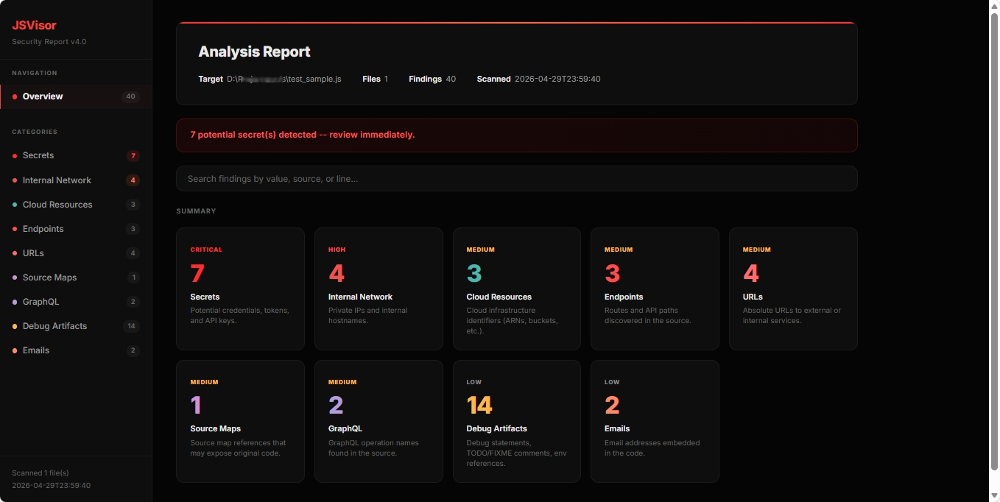
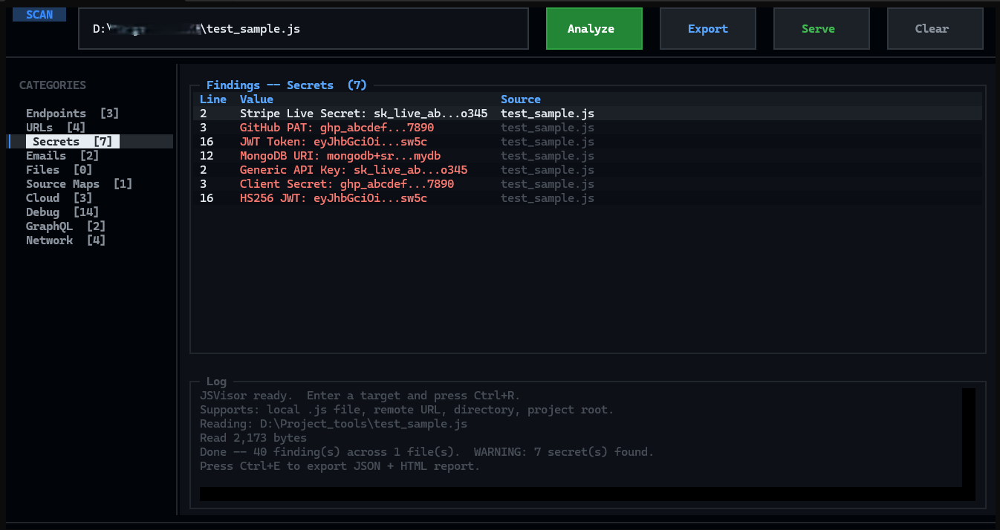

# JSVisor -- Advanced JavaScript Security Scanner

[](https://www.python.org)
[](LICENSE)

Static analysis tool for JavaScript source files. Extracts **endpoints, secrets, URLs, emails, files, source maps, cloud resources, debug artifacts, GraphQL operations, and internal network indicators** from JavaScript source code.

Generates **JSON / HTML / SARIF / Postman / Markdown** reports. Supports **AST parsing**, **entropy-based secret detection**, **framework-aware analysis**, **multi-threaded scanning**, and a **Textual TUI**.

<p align="center">
  
</p>

---

## Features

| Category | Description |
|----------|-------------|
| **AST Analysis** | JavaScript parsing via `esprima`, string deobfuscation (`\xHH`, `\uXXXX`, `atob`/`btoa`) |
| **Secret Detection** | Shannon entropy scoring, context-aware confidence, JWT/admin/default credential detection |
| **Framework Detection** | React, Vue, Angular, Next.js, Nuxt, jQuery, Axios pattern recognition |
| **Network Discovery** | URL resolution, API version detection, GraphQL introspection, Swagger/OpenAPI |
| **Repository Analysis** | `package.json` parsing, dependency vulnerability check, `.git` metadata, env injection risks |
| **Reporting** | HTML (search, filter, copy), SARIF (CI/CD), Postman collection, Markdown summary |
| **Performance** | Multi-threaded scanning, incremental cache (SHA-256), `.gitignore` support, streaming |
| **Integration** | HTTP daemon, GitHub Action template, pre-commit hook, Slack/Teams notifications |
| **Security** | Input validation, secret auto-redaction, encrypted ZIP, `--no-network` safe mode |
| **Artifact Detection** | WebAssembly, browser storage keys, CORS misconfiguration, CDN provider summary |

---

## Installation

```bash
# Clone
git clone https://github.com/user/jsvisor.git
cd jsvisor

# Virtual environment
python -m venv venv
source venv/bin/activate    # Linux/Mac
# .\venv\Scripts\activate   # Windows

# Dependencies
pip install -r requirements.txt
```

### Dependencies

| Package | Purpose |
|---------|---------|
| `textual` | Terminal UI framework |
| `esprima` | JavaScript AST parsing (optional) |
| `pathspec` | `.gitignore` pattern matching (optional) |
| `pycryptodome` | Password-protected ZIP export (optional) |

Core scanning works without optional dependencies. Enable them for extended features.

---

## Usage

### Interactive TUI (default)

```bash
python js_analyzer.py
# or, if installed via pip:
jsvisor
```

### CLI

```bash
# Single file
jsvisor -f app.bundle.js -o report

# Remote URL
jsvisor -u https://example.com/main.js -o report

# Directory scan (multi-threaded)
jsvisor -d ./src --threads 8 -o report

# Full analysis
jsvisor -d ./project \
  --ast --entropy --frameworks \
  --base-url https://api.example.com \
  --threads 8 \
  --format json html sarif postman markdown \
  --redact \
  -o analysis_report
```

### CLI Flags

| Flag | Description |
|------|-------------|
| `-f, --file FILE` | Single local JS file |
| `-u, --url URL` | Remote JS URL |
| `-d, --directory DIR` | Scan directory recursively |
| `-o, --output NAME` | Output base name |
| `-v, --verbose` | Show file:line per finding |
| `--ast` | Enable AST-based analysis |
| `--entropy` | Enable Shannon entropy scoring |
| `--frameworks` | Enable framework detection |
| `--base-url URL` | Base URL for resolving relative endpoints |
| `--graphql-introspect` | Run GraphQL introspection on discovered endpoints |
| `--threads N` | Thread count for directory scanning (default: 4) |
| `--incremental` | Skip unchanged files via SHA-256 cache |
| `--respect-gitignore` | Exclude files matching `.gitignore` patterns |
| `--format FMT [...]` | Output formats: `json`, `html`, `sarif`, `postman`, `markdown` |
| `--daemon` | Start HTTP daemon mode |
| `--daemon-port PORT` | Daemon port (default: 8080) |
| `--redact` | Redact secrets in output and reports |
| `--no-network` | Disable all outbound network requests |
| `--encrypt` | Create password-protected ZIP of reports |
| `--password PWD` | Password for encrypted ZIP |
| `--notify-webhook URL` | Slack/Teams webhook for notifications |
| `--debug` | Enable debug-level logging |
| `--serve` | Serve HTML report in browser after export |
| `--port PORT` | Port for `--serve` (default: 7777) |
| `--install-hook` | Install pre-commit git hook |

---

## Screenshots

### HTML Report
Self-contained single-file report with dark theme, severity-sorted categories, search/filter, collapsible file groups, and copy-to-clipboard.

<p align="center">
  
</p>

### Interactive TUI
Terminal-based interface with category sidebar, findings table, log panel, and keyboard shortcuts.

<p align="center">
  
</p>

---

## Output Formats

### HTML Report
Self-contained single-file report with dark theme, severity-sorted categories, search/filter, collapsible file groups, and copy-to-clipboard.

### SARIF
GitHub Code Scanning compatible format for CI/CD pipelines.

### Postman Collection
All discovered endpoints as a ready-to-use Postman collection.

### Markdown Summary
Risk-prioritized summary organized as Critical, High, Medium, Low.

---

## Integration

### HTTP Daemon

```bash
jsvisor --daemon --daemon-port 8080

# Analyze a target
curl -X POST http://127.0.0.1:8080/analyze \
  -H "Content-Type: application/json" \
  -d '{"target": "./src/app.js"}'

# Health check
curl http://127.0.0.1:8080/health
```

### Slack / Teams Notifications

Set the appropriate environment variable to receive scan results:

```bash
export JSVISOR_SLACK_WEBHOOK="https://hooks.slack.com/services/..."
export JSVISOR_TEAMS_WEBHOOK="https://outlook.office.com/webhook/..."

jsvisor -d ./src -o report
```

Or pass inline:
```bash
jsvisor -d ./src --notify-webhook "https://hooks.slack.com/services/..."
```

### Pre-commit Hook

```bash
jsvisor --install-hook
```

### GitHub Action

Copy `templates/github-action.yml` to `.github/workflows/` in your repository.

---

## Security

- **Input validation**: URL scheme checks, path traversal guards, file size limits (50 MB), symlink detection
- **Secret redaction**: `--redact` flag masks secrets in all output (first 4 + last 4 characters)
- **Safe mode**: `--no-network` prevents all outbound HTTP requests
- **Encrypted export**: `--encrypt --password <PWD>` creates AES-encrypted ZIP
- **XSS prevention**: All HTML report content is escaped via `html.escape`
- **Daemon security**: Binds to localhost by default, validates request paths, limits body size

---

## Architecture

```
js_analyzer.py              Main entry point
js_analyzer/
  __init__.py
  ast_analyzer.py           AST parsing (esprima)
  entropy.py                Shannon entropy + secret validation
  frameworks.py             Framework detection
  network.py                Network discovery + GraphQL
  repo_analysis.py          Package.json, .git, dependencies
  exporters.py              SARIF, Postman, Markdown
  performance.py            Threading, caching, gitignore
  daemon.py                 HTTP daemon mode
  notifications.py          Slack/Teams webhooks
  security.py               Redaction, encryption
  artifacts.py              WASM, storage, CORS, CDN
  html_report.py            HTML report generator
```

---

## License

MIT License -- see [LICENSE](LICENSE) for details.
